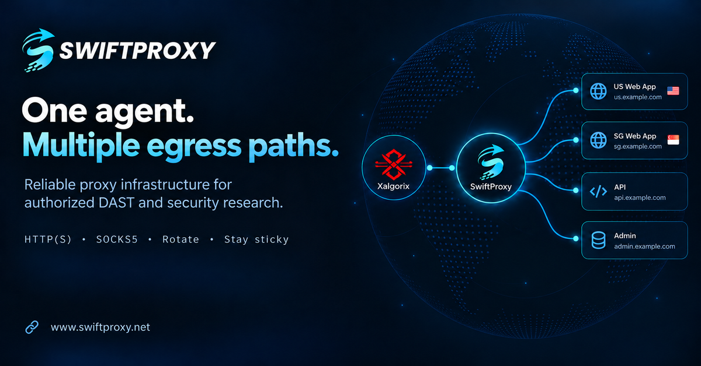

<div align="center">


<br />

[](https://go.dev)
[](LICENSE)
[](#-installation)
[](https://www.xalgorix.com/)
[](https://github.com/xalgorix/xalgorix/stargazers)
[](https://github.com/xalgorix/xalgorix/network/members)
[](https://github.com/xalgorix/xalgorix/releases)

[](https://deepwiki.com/xalgorix/xalgorix)

<a href="https://trendshift.io/repositories/35278?utm_source=trendshift-badge&amp;utm_medium=badge&amp;utm_campaign=badge-trendshift-35278" target="_blank" rel="noopener noreferrer"></a>

</div>

<h1 align="center">Xalgorix — Open-source AI pentester that <em>proves</em> vulnerabilities</h1>

<p align="center">
  <strong>Most scanners detect. Xalgorix proves.</strong> An autonomous LLM agent works a full pentest methodology, then an <strong>independent verifier re-exploits every finding</strong> before it's reported — so you get proof, not a pile of maybes to triage. Self-hosted, private, and bring-your-own-LLM. Built in Go + TypeScript.
</p>

<p align="center">
  <a href="#-quick-start">🚀 Quick Start</a> ·
  <a href="#-why-xalgorix">💡 Why Xalgorix</a> ·
  <a href="#-features">✨ Features</a> ·
  <a href="#-use-cases">🎯 Use Cases</a> ·
  <a href="#-sponsors">🤝 Sponsors</a> ·
  <a href="https://www.xalgorix.com/">☁️ Hosted Cloud</a> ·
  <a href="https://docs.xalgorix.com">📖 Docs</a>
</p>

---

## 🤝 Sponsors

Thanks to **[Swiftproxy](https://www.swiftproxy.net/?ref=xalgorix)** for sponsoring Xalgorix.

<a href="https://www.swiftproxy.net/?ref=xalgorix">
  
</a>

Your app can behave differently depending on where a request comes from. For Xalgorix users checking their own applications across regions, Swiftproxy offers **location targeting** to review regional behavior and **sticky sessions** to help keep a consistent IP during a test session. It supports **HTTP(S) and SOCKS5**, the same proxy protocols Xalgorix supports.

Residential proxies from **$0.70/GB**. **Free testing is available**, and Xalgorix users get **10% off** with code **`PROXY90`**.

[**Explore Swiftproxy and request a free test →**](https://www.swiftproxy.net/?ref=xalgorix)

---

## 📸 Screenshots

**🖥️ Self-hosted dashboard** — runs locally on `127.0.0.1:9137`

| Overview dashboard                                      | Scan detail                                      | Findings                                      |
| ------------------------------------------------------- | ------------------------------------------------ | --------------------------------------------- |
|  |  |  |

**☁️ Hosted cloud dashboard** — the fully managed version at [www.xalgorix.com](https://www.xalgorix.com/)


---

## 🚀 Quick Start

**Install (one line):**

```bash
curl -sSL https://www.xalgorix.com/install | bash
```

This downloads the prebuilt binary for your platform (Linux or macOS, amd64/arm64) from the latest release. Then run the interactive setup wizard:

```bash
xalgorix --setup
```

Choose your provider, confirm a model, and enter the API key when prompted. For best results, use a current frontier model with strong reasoning, long-context performance, and reliable tool calling—such as the latest capable GPT, Claude, or Gemini model available to you. Smaller or local models remain supported, but may require more supervision during long autonomous scans. Xalgorix stores the key privately in `~/.xalgorix.env` (mode `0600`) and can launch the dashboard for you. Local Ollama needs no API key.

If you choose not to launch immediately, start later with `xalgorix --web` and open `http://127.0.0.1:9137`. You can change providers or advanced options at any time under **Settings → LLM**, or rerun `xalgorix --setup`.

**Or run with Docker — batteries included, no toolchain needed:**

```bash
docker run --rm -p 9137:9137 \
  --privileged \
  -v xalgorix-data:/data \
  xalgord/xalgorix:latest
```

`--privileged` gives the toolset the same host-like access it has when run natively as root. Docker's default sandbox drops capabilities (like `NET_ADMIN`) and applies a seccomp filter, which breaks low-level tools (iptables/route changes, ARP-spoof/MITM, tun/tap VPNs, ptrace-based debuggers, masscan interface tuning). Since an image can't grant itself these, they must be set at run time. The container is a disposable, network-isolated scanning sandbox running as root — privileged is the intended posture; never expose the dashboard publicly without auth. Prefer least-privilege? Swap `--privileged` for `--cap-add=NET_ADMIN --cap-add=NET_RAW --cap-add=SYS_PTRACE --security-opt seccomp=unconfined`.

Open `http://localhost:9137`. You **don't need an LLM key to start** — the dashboard launches without one; set the model + API key under **Settings → LLM** (it persists to the `/data` volume). If you don't pass `XALGORIX_USERNAME`/`XALGORIX_PASSWORD`, a random admin password is generated and printed to the container logs on first run.

**Easiest — Docker Compose** (maps the port + a persistent volume for you):

```bash
curl -sSLO https://raw.githubusercontent.com/xalgorix/xalgorix/main/docker-compose.yml
docker compose up -d
docker compose logs -f   # shows the generated admin password on first start
```

The image ships an extensive offensive-security toolset preinstalled (nmap, nuclei, httpx, subfinder, katana, ffuf, gobuster, sqlmap, masscan, dalfox, feroxbuster, and more) **and** keeps every package manager (apt, go, cargo, pipx, npm) available so the agent can still auto-install anything missing at runtime. It runs as root inside the container by design — treat the container as a disposable, network-isolated scanning sandbox and never expose the dashboard without auth. Images are published for both amd64 and arm64.

**Or build from source** (needs Go 1.26+ and Node.js):

```bash
git clone https://github.com/xalgorix/xalgorix.git
cd xalgorix
make build
sudo install -m 755 build/xalgorix /usr/local/bin/xalgorix
```

> [!TIP]
> Prefer zero setup? A fully managed version runs at [www.xalgorix.com](https://www.xalgorix.com/) — click-to-scan, no install or API keys required.

### 🤖 Review pull requests automatically — free GitHub App

Want a security review on every pull request with zero setup? Install the **[Xalgorix GitHub App](https://github.com/apps/xalgorix)**. It reads each PR's diff and comments a security review — injection, broken auth/IDOR, SSRF, secrets, unsafe patterns — right on the pull request. Updates in place on new commits, and you can comment **`@xalgorix review`** to re-run on demand. No workflow file, no API key, no account — and it's free.

<div align="center">

[**➕ Add Xalgorix to GitHub →**](https://github.com/apps/xalgorix/installations/new)

</div>

For merge gating and full exploit-verified pentests in CI, use the [hosted scanner](https://www.xalgorix.com/) or the GitHub Action.

> [!IMPORTANT]
> Use Xalgorix only on systems you own or have explicit permission to test.

> [!TIP]
> Prefer not to self-host? A fully managed version is available at [www.xalgorix.com](https://www.xalgorix.com/) — click-to-scan, no install or API keys required.

## 📚 Contents

| | | |
| --- | --- | --- |
| 📸 [Screenshots](#-screenshots) | 🔩 [Configuration](#-configuration) | 🧾 [Environment Variables](#-environment-variables) |
| 🚀 [Quick Start](#-quick-start) | 🆙 [Upgrading](#-upgrading-from-previous-versions) | 🔤 [Provider Prefixes](#-provider-prefixes) |
| 🔎 [Overview](#-overview) | 🏃 [Running](#-running) | 💻 [CLI Reference](#-cli-reference) |
| 💡 [Why Xalgorix](#-why-xalgorix) | 🧰 [Service Mode](#-service-mode) | 📡 [API Summary](#-api-summary) |
| 🎯 [Use Cases](#-use-cases) | 🔁 [Web UI Workflow](#-web-ui-workflow) | 💾 [Data Storage](#-data-storage) |
| ✨ [Features](#-features) | 🔀 [Scan Modes](#-scan-modes) | 🧪 [Development](#-development) |
| 📥 [Installation](#-installation) | 📂 [Scan Your Code](#-scan-your-code-no-target-needed) | 🚨 [Safety Notes](#-safety-notes) |
| 🧭 [Methodology](#-methodology) | 📄 [Reports](#-reports) | 📜 [License](#-license) |
| 🔧 [Settings](#-settings) | 🔗 [Links](#-links) | 🤝 [Sponsors](#-sponsors) |

## 🔎 Overview

Xalgorix is a self-hosted AI penetration testing platform for authorized security testing, vulnerability assessment, and bug bounty workflows. It combines an LLM-driven autonomous agent, browser automation, terminal tooling, a comprehensive 22-phase testing methodology, live WebSocket telemetry, finding management with CVSS scoring, branded PDF report generation, and integrations for AgentMail, Discord, and Telegram.

Unlike cloud-only DAST scanners, Xalgorix runs entirely on your machine. You bring your own LLM provider (OpenAI, Anthropic, DeepSeek, Gemini, Groq, Ollama, MiniMax) and control the model, reasoning effort, rate limits, and proxy configuration. No scan data, API keys, or target information leaves your infrastructure.

The default experience is the Web UI. From one local dashboard you can start scans, monitor active runs, inspect findings, configure model/provider settings, manage environment variables, generate branded PDF reports, and delete or resume historical scans.

## 💡 Why Xalgorix

Most scanners **detect**. Xalgorix **proves**. An autonomous agent works through a 22-phase methodology, then an independent verifier re-tests every candidate finding before it is reported — so you get exploit-verified results with evidence, not a wall of "maybes" to triage.

- 🧠 **An AI agent, not a template engine** — reasons about auth flows, business logic, IDOR/BOLA, and chained exploits that signature scanners miss.
- ✅ **Exploit-verified findings** — a separate verifier independently reproduces each finding; inconclusive ones are flagged for review, never dressed up as confirmed.
- 🔒 **Self-hosted and private** — runs on your machine with your own LLM key; no target data, keys, or findings leave your infrastructure.
- 🧩 **Bring your own LLM** — OpenAI, Anthropic, DeepSeek, Gemini, Groq, Ollama, or MiniMax — or any OpenAI-compatible gateway like [LiteLLM](#-litellm--openai-compatible-gateways-github-copilot-claude-opus-codex-openrouter-azure-local-models) (GitHub Copilot, Codex, OpenRouter, Azure). You control model, reasoning effort, and cost.
- 📄 **Audit-ready reports** — branded PDFs with CVSS scores, proof-of-concept, and remediation.

### 📊 How it compares

|                                              | **Xalgorix**             | Template scanners (e.g. Nuclei) | Crawling scanners (e.g. OWASP ZAP) | Commercial DAST        |
| -------------------------------------------- | ------------------------ | ------------------------------- | ---------------------------------- | ---------------------- |
| Approach                                     | Autonomous AI agent      | Signatures / templates          | Spider + active rules              | Signatures + heuristics |
| Business logic / IDOR / auth-bypass coverage | ✅                       | Limited                         | Limited                            | Partial                |
| Exploit-verified (proves impact)             | ✅ independent verifier  | ❌                              | ❌                                 | Partial                |
| False-positive load                          | Low (proven)             | Template-dependent              | High                               | Medium                 |
| Self-hosted / data stays local               | ✅                       | ✅                              | ✅                                 | Usually cloud          |
| Bring-your-own LLM                           | ✅                       | —                               | —                                  | ❌                     |
| Branded PDF reports                          | ✅                       | ❌                              | Basic                              | ✅                     |
| Cost                                         | Open source + your LLM   | Free                            | Free                               | $$$                    |

> Directional comparison — Nuclei and ZAP are excellent at what they do. Xalgorix adds the reasoning-heavy discovery and exploit-verification layer on top.

### ☁️ Self-hosted vs Hosted cloud

Xalgorix is free and open source — self-host it forever, no strings attached. The [hosted cloud](https://www.xalgorix.com/) runs the **same** exploit-verified engine; it exists for people who'd rather not manage API keys, infrastructure, and unpredictable LLM bills. Both are first-class — pick what fits.

|                                    | **Self-hosted** (this repo)              | **[Hosted cloud](https://www.xalgorix.com/)**   |
| ---------------------------------- | ---------------------------------------- | ----------------------------------------------- |
| Price to start                     | Free engine, Apache-2.0                  | Free account · one-time $1 evaluation           |
| LLM API key                        | Bring & manage your own                  | Included — none to wrangle                      |
| Cost per scan                      | Raw LLM tokens — variable, can spike     | 1 credit per live host — predictable            |
| Setup & ops                        | You install, update & run the toolchain  | Nothing to run — scan in ~60s                   |
| Out-of-band infra (SSRF/blind RCE) | Stand up your own OOB server             | Managed OOB included                            |
| Scheduling                         | Built-in scheduler on your infrastructure | Managed daily / hourly schedules             |
| Team · RBAC · shared credits        | Single-operator instance                 | Organization workspaces on Team                 |
| Updates                            | `git pull` + rebuild                     | Always on the latest engine                     |
| Data residency / offline           | ✅ stays on your infra · air-gap OK       | Runs on our infra (DPA available)               |

**Self-host if** data must stay on your network, you want full control, or you'll run offline/air-gapped — that's exactly what it's for. **Use the cloud if** you'd rather skip the API keys, infra, and surprise token bills, and pay only for the live hosts you actually scan.

<div align="center">

[**☁️ Evaluate hosted Cloud — $1 trial →**](https://www.xalgorix.com/pricing) &nbsp;·&nbsp; [**⚖️ Compare Cloud and self-hosting →**](https://www.xalgorix.com/hosted-vs-self-hosted)

</div>

If Xalgorix saves you a triage cycle, please **[⭐ star the repo](https://github.com/xalgorix/xalgorix)** — it genuinely helps others find it.

## 🎯 Use Cases

| Use Case | How Xalgorix helps |
| -------- | ------------------ |
| **Penetration testing** | Run a full 22-phase methodology against authorized targets. The AI agent handles reconnaissance, vulnerability discovery, injection testing, SSRF, IDOR, auth bypass, race conditions, and more — then verifies findings before reporting. |
| **Bug bounty hunting** | Point Xalgorix at an in-scope target and let the agent enumerate the attack surface, test for common vulnerability classes, and surface verified findings with CVSS scores and proof-of-concept evidence. |
| **Red team operations** | Use wildcard and multi-target scan modes to map an organization's external attack surface. Browser-assisted DAST handles auth flows, forms, and runtime behavior that static scanners miss. |
| **Security research** | The novel-vulnerability-discovery phase pushes the agent beyond known template matching. Bring your own LLM (OpenAI, Anthropic, DeepSeek, Gemini, Ollama, MiniMax) to control reasoning depth and cost. |
| **Continuous security testing** | Run as a system service with `xalgorix --start`. Scan on a schedule, stream findings to Discord or Telegram, and generate branded PDF reports for stakeholders. |
| **DAST automation** | Browser-driven testing for web applications — auth flows, forms, JavaScript-rendered content, and runtime behavior. Integrates with Caido for proxy traffic inspection. |

## ✨ Features

| Area           | Capabilities                                                                                                                |
| -------------- | --------------------------------------------------------------------------------------------------------------------------- |
| 📊 Dashboard      | Local Web UI on `127.0.0.1:9137` by default, scan management, live status, bulk scan actions, and historical scan recovery. |
| 🔍 Scanning       | Single target, DAST, wildcard, and multi-target flows with selectable methodology phases.                                   |
| 📡 Live telemetry | Tool calls, agent messages, findings, errors, HTTP activity, and LLM activity over WebSockets.                              |
| 🐞 Findings       | Scan detail pages, severity filters, CVSS details, finding index, and verified finding workflows.                           |
| 📄 Reporting      | Branded PDF reports with target/company name, uploaded logo, report list, open/download/delete actions.                     |
| 🔔 Integrations   | AgentMail test inboxes, verification emails, OTP flows, email triage events, Discord and Telegram notifications.            |
| ⚙️ Configuration  | Dashboard settings for LLM, AgentMail, Discord, Telegram, proxy, runtime, browser, auth, rate limits, and resources.       |
| 🛡️ Runtime safety | Resource-aware instance limits and loopback-only binding unless external access is explicitly configured with auth.         |

## 📥 Installation

The fastest paths need no toolchain at all.

### ⚡ One-line install (prebuilt binary)

```bash
curl -sSL https://www.xalgorix.com/install | bash
```

Downloads the latest release binary for your platform (Linux or macOS, `amd64`/`arm64`) and installs it to `/usr/local/bin` (or `~/.local/bin` without sudo). Override with `XALGORIX_INSTALL_DIR` or pin a version with `XALGORIX_VERSION=vX.Y.Z`.

Complete first-time configuration interactively—no manual environment-file editing required:

```bash
xalgorix --setup
```

The wizard preserves existing settings when rerun, hides API-key input in a terminal, and optionally launches the Web UI when finished.

### 🐳 Docker

```bash
docker run --rm -p 9137:9137 \
  --privileged \
  -e XALGORIX_LLM=openai/gpt-5.6 \
  -e XALGORIX_API_KEY=your_openai_api_key \
  -v xalgorix-data:/data \
  ghcr.io/xalgord/xalgorix:latest
```

`--privileged` (or the narrower `--cap-add=NET_ADMIN --cap-add=NET_RAW --cap-add=SYS_PTRACE --security-opt seccomp=unconfined`) gives the toolset host-like access. Docker's default sandbox drops capabilities and filters syscalls, which breaks low-level tooling (iptables/route/interface changes, ARP-spoof/MITM, tun/tap VPNs, ptrace-based debuggers). An image can't grant these to itself — they're a run-time decision — so pass the flag, or use the provided `docker-compose.yml`, which sets it for you.

The image is **batteries-included**: an extensive offensive-security toolset is preinstalled (nmap, nuclei, httpx, subfinder, dnsx, naabu, katana, ffuf, gobuster, dalfox, feroxbuster, sqlmap, masscan, nikto, whatweb, hydra, and more), plus Chromium for browser-assisted DAST. It also keeps the full package-manager set (apt, go, cargo, pipx, npm) available, so the agent auto-installs anything missing at runtime. Scan data persists to the `/data` volume, and the server binds `0.0.0.0` inside the container — set `XALGORIX_USERNAME`/`XALGORIX_PASSWORD` before exposing it beyond localhost.

The container runs as root by design (the engine only enables runtime auto-install for uid 0, and apt/go/cargo installs need system write access). Treat it as a disposable, network-isolated scanning sandbox. The same tags publish a multi-platform manifest for `linux/amd64` and `linux/arm64`, so Docker selects the native image automatically.

On first run, if you don't set dashboard auth the container **generates a random admin password and prints it to the logs** (the image binds `0.0.0.0`, which the engine won't do without auth). Set `XALGORIX_USERNAME` + `XALGORIX_PASSWORD` (or `XALGORIX_PASSWORD_HASH`) to use your own. The binary never self-updates inside the container (`XALGORIX_NO_AUTO_UPDATE=1`) — pull a new image tag to upgrade. The **nuclei** engine and its vuln templates are refreshed to the latest on every image build (the release CI and `redeploy.sh` force this); pass `--build-arg NUCLEI_VERSION=vX.Y.Z` to pin the engine, or `NUCLEI_REFRESH=0 ./redeploy.sh` to reuse Docker's cache.

### 📋 Requirements (build from source)

| Requirement    | Notes                                                        |
| -------------- | ------------------------------------------------------------ |
| OS             | Linux or macOS (`amd64`/`arm64`).                            |
| Go             | `1.26` or newer.                                             |
| Node.js + npm  | Required when building the bundled React Web UI from source. |
| Security tools | Installed on demand only when auto-install is enabled.       |

Check your Go version:

```bash
go version
```

### 🔨 Build From Source

```bash
git clone https://github.com/xalgorix/xalgorix.git
cd xalgorix
make build
sudo install -m 755 build/xalgorix /usr/local/bin/xalgorix
```

`make build` builds the React Web UI into `internal/web/static`, then builds the Go binary.

### 📦 Install With Go

```bash
GOPROXY=direct GOSUMDB=off go install github.com/xalgord/xalgorix/v4/cmd/xalgorix@latest
```

## 🔩 Configuration

Xalgorix loads configuration in this order. Later sources override earlier ones.

| Order | Source                                                         |
| ----- | -------------------------------------------------------------- |
| 1     | `/etc/xalgorix.env`                                            |
| 2     | `/home/<sudo-user>/.xalgorix.env` when launched through `sudo` |
| 3     | `~/.xalgorix.env`                                              |
| 4     | Environment variables already present in the process           |

Create the local environment file:

```bash
nano ~/.xalgorix.env
```

### 🧩 Minimal Config

For the strongest autonomous scanning results, select a current frontier model. The model ID below is a concrete example; newer compatible model IDs can be entered without waiting for a Xalgorix release.

```bash
XALGORIX_LLM=openai/gpt-5.6
XALGORIX_API_KEY=your_openai_api_key
```

### 🔌 Provider Examples

OpenAI:

```bash
XALGORIX_LLM=openai/gpt-5.6
XALGORIX_API_KEY=sk-...
```

Custom OpenAI-compatible provider:

```bash
XALGORIX_LLM=custom/security-model
XALGORIX_API_BASE=https://your-provider.example/v1
XALGORIX_API_KEY=your_provider_api_key
```

#### 🌉 LiteLLM / OpenAI-compatible gateways (GitHub Copilot, Claude Opus, Codex, OpenRouter, Azure, local models)

Because `XALGORIX_API_BASE` accepts any OpenAI-compatible `/v1/chat/completions` endpoint,
Xalgorix works with a [LiteLLM](https://docs.litellm.ai/) proxy out of the box — no
Xalgorix-side changes needed. LiteLLM handles the upstream provider auth (Copilot device
login, Azure keys, OpenRouter, Ollama, etc.); Xalgorix just talks OpenAI to the gateway.

Run LiteLLM (example `config.yaml`):

```yaml
model_list:
  - model_name: claude-opus-5
    litellm_params:
      model: github_copilot/claude-opus-5   # or openrouter/…, azure/…, ollama/…
general_settings:
  master_key: sk-local-litellm-key
```

Point Xalgorix at it — use the `custom/` prefix so the model name is sent verbatim and the
OpenAI chat-completions protocol is used:

```bash
XALGORIX_LLM=custom/claude-opus-5            # the LiteLLM model_name
XALGORIX_API_BASE=http://localhost:4000/v1     # your LiteLLM proxy
XALGORIX_API_KEY=sk-local-litellm-key          # LiteLLM master_key / virtual key
```

The same pattern covers GitHub Copilot Business/CLI, Claude Opus, Codex-style models,
OpenRouter, Azure OpenAI, and local Ollama models — anything LiteLLM can route. Keep the
`custom/` (or `openai/`) prefix and a non-Anthropic/Gemini `XALGORIX_API_BASE` so Xalgorix
uses the standard OpenAI request shape that LiteLLM expects.

### 🔔 Optional Integrations

```bash
GEMINI_API_KEY=AIza...
AGENTMAIL_POD=am_us_pod_47
AGENTMAIL_API_KEY=ak_...
XALGORIX_DISCORD_WEBHOOK=https://discord.com/api/webhooks/...
XALGORIX_DISCORD_MIN_SEVERITY=high
```

### 🔐 Dashboard Authentication

```bash
XALGORIX_USERNAME=admin
XALGORIX_PASSWORD=change-this-password
```

> [!TIP]
> Prefer `XALGORIX_PASSWORD_HASH` for production deployments.

## 🆙 Upgrading from previous versions

This release ships a stability and workspace-isolation pass with one breaking change and a few new knobs worth knowing about.

### 💥 Breaking change: default workspace moved to `~/.xalgorix/data/`

Scan output, notes, schedules, and other generated artefacts now live under `~/.xalgorix/data/` instead of `$CWD` (the directory the binary was launched from).

To retain the previous behavior, point `XALGORIX_DATA_DIR` at your current working directory:

```bash
export XALGORIX_DATA_DIR=$(pwd)
```

A `[MIGRATION]` warning is emitted at startup when legacy markers (`notes.json`, `_schedules/`, `vulnerabilities.json`, or `YYYY-MM-DD/scan-*` directories) are detected in `$CWD` and `XALGORIX_DATA_DIR` is unset. Xalgorix never reads, copies, or deletes those legacy files automatically; the warning is informational and only fires once per process.

### 🆕 New environment variable

| Variable                     | Default                       | Description                                                                                              |
| ---------------------------- | ----------------------------- | -------------------------------------------------------------------------------------------------------- |
| `XALGORIX_LLM_MAX_INFLIGHT`  | `4 × EffectiveMaxInstances`   | Caps simultaneous outbound LLM calls across all running scans. Minimum `1`. Cancelled waiters do not consume a slot. |

### 🩺 New health endpoint counters

`GET /api/status` now exposes:

| Field                 | Meaning                                                                              |
| --------------------- | ------------------------------------------------------------------------------------ |
| `panics_recovered`    | Goroutine, HTTP handler, and tool panics that were recovered without crashing.       |
| `path_rejections`     | Filesystem writes refused by Path_Policy (outside `data_dir` / `~/.xalgorix/` / `/tmp`). |
| `watchdog_kills`      | Subprocesses terminated by the per-tool hard-timeout watchdog.                       |
| `admission_refusals`  | Scan admission requests denied due to the concurrency ceiling.                       |
| `llm_inflight_cap`    | Effective `XALGORIX_LLM_MAX_INFLIGHT` value for this process.                        |
| `data_dir`            | Resolved Data_Dir in use.                                                            |
| `allow_list`          | Filesystem roots accepted by Path_Policy.                                            |

## 🏃 Running

### 🪟 Web UI

```bash
xalgorix --web
```

Open:

```text
http://127.0.0.1:9137
```

Use a different port:

```bash
xalgorix --web --port 8080
```

### 🌐 External Access

Bind to another interface only after enabling dashboard authentication:

```bash
XALGORIX_USERNAME=admin XALGORIX_PASSWORD=change-this xalgorix --web --bind 0.0.0.0
```

> [!WARNING]
> The server refuses external binding without dashboard authentication.

### 🏹 CLI Scan

```bash
xalgorix --target https://example.com
```

With custom instructions:

```bash
xalgorix --target https://app.example.com --instruction "Focus on SQL injection, IDOR, and auth bypass. Avoid destructive tests."
```

## 🧰 Service Mode

Install and start as a system service:

```bash
sudo xalgorix --start
```

Manage the service:

```bash
sudo xalgorix --restart
sudo xalgorix --stop
sudo xalgorix --uninstall
```

View logs:

```bash
journalctl -u xalgorix -f
```

### 🌍 Remote Service Access

Expose the service to remote browsers only after enabling dashboard auth:

```bash
sudo tee -a /root/.xalgorix.env >/dev/null <<'EOF'
XALGORIX_BIND=0.0.0.0
XALGORIX_USERNAME=admin
XALGORIX_PASSWORD=change-this
EOF

sudo xalgorix --restart
```

Then open `http://<server-ip>:9137`.

If the process is listening but the page still does not load remotely, allow TCP port `9137` in the server firewall or cloud security group.

#### 🏠 Scanning local/internal targets

By default Xalgorix refuses to scan loopback, `localhost`, private-range, or
its own interface addresses — they're the machine Xalgorix runs on, not a
target. On a **self-hosted, single-tenant** box you can opt in to scan a
locally-hosted demo/staging app:

```bash
echo 'XALGORIX_ALLOW_LOCAL_TARGETS=true' | sudo tee -a /root/.xalgorix.env
sudo xalgorix --restart
```

The dashboard's own listener is **always** protected, even with this enabled.

> **⚠️ Shared / multi-tenant / hosted deployments: keep this OFF.** Enabling it
> would let a user's scan reach the operator's own machine and internal network.
> It is off by default, so no action is needed to stay safe — do not set
> `XALGORIX_ALLOW_LOCAL_TARGETS` (or pin `XALGORIX_ALLOW_LOCAL_TARGETS=false`),
> and don't expose the engine's Settings page to untrusted users.

## 🔁 Web UI Workflow

1. Open the dashboard at `http://127.0.0.1:9137`.
2. Go to Settings and confirm the LLM provider, API key, rate limits, and optional integrations.
3. Create a scan from New Scan.
4. Choose a scan mode.
5. Select methodology phases when you want a focused run.
6. Set severity filters when only certain severities should be reported live. The filter affects the real-time dashboard feed and notifications only; the PDF report and `/api/findings` always include every vulnerability the agent discovered.
7. Add company name and upload a logo for branded reports.
8. Monitor progress from Overview, Scan Detail, or Live Feed.
9. Open finding details, download reports, or manage historical scans from Scans and Reports.

## 🔀 Scan Modes

| Mode             | Best for                                                                        |
| ---------------- | ------------------------------------------------------------------------------- |
| 🎯 Single target    | Testing one known URL or host.                                                  |
| 🌐 Wildcard / multi | Enumerating related targets and scanning the discovered attack surface.         |
| 🧭 DAST             | Browser-assisted testing for web apps, auth flows, forms, and runtime behavior. |

## 📂 Scan Your Code (no target needed)

Point Xalgorix at a codebase — a Git URL, a local path, or an uploaded zip — and
it scans the source directly. No deployed URL, no infrastructure to stand up.

```bash
# Source review (SAST): audit the code, no running target required
xalgorix --source ./my-app --code-scan review

# Provision + DAST: build & run the app locally, then pentest the running instance
xalgorix --source https://github.com/org/app.git --code-scan provision
```

| Code-scan mode | What it does | Verification level |
| -------------- | ------------ | ------------------ |
| `review` | Reads the source, traces user input from entry point → dangerous sink, and reports reachable vulnerabilities. No live target. | **Source-verified** — proven reachable in code (clearly labeled as not runtime-exploited). |
| `provision` | Inspects the repo, builds and runs the app on a loopback port, then runs whitebox-guided DAST against the running instance. Falls back to `review` if the app can't be built. | **Exploit-verified** — reproduced against the running app. |

- `--source` accepts a Git URL (shallow-cloned), a local directory, or a path to
  an uploaded/extracted archive. In the Web UI / hosted app you can also upload a
  `.zip` of your codebase (`POST /api/upload-source`).
- You can still combine a repo **and** a live target for classic whitebox
  augmentation — that path is unchanged. Code-scan modes are for when the
  codebase is the whole subject.

> Provision mode runs your app's build/start commands in the agent's sandbox and
> only pentests the single loopback port it stood the app up on — the dashboard
> and everything else on the machine stay out of scope.

## 🧭 Methodology

Xalgorix organizes autonomous testing into 22 phases.

| Phase | Focus                                      |
| ----: | ------------------------------------------ |
|     1 | Reconnaissance                             |
|     2 | Manual vulnerability discovery             |
|     3 | Directory and file discovery               |
|     4 | CORS and cookie analysis                   |
|     5 | Authentication and session testing         |
|     6 | Injection testing                          |
|     7 | SSRF testing                               |
|     8 | IDOR and broken access control             |
|     9 | API and GraphQL testing                    |
|    10 | File upload testing                        |
|    11 | Deserialization and RCE                    |
|    12 | Race conditions and business logic         |
|    13 | Subdomain takeover                         |
|    14 | Open redirect testing                      |
|    15 | Email security testing                     |
|    16 | Cloud and infrastructure                   |
|    17 | WebSocket testing                          |
|    18 | CMS-specific testing                       |
|    19 | Broken link hijacking and content spoofing |
|    20 | Exploit verification                       |
|    21 | Novel vulnerability discovery              |
|    22 | Final report                               |

Phase selection in the Web UI lets you run every phase or only the subset needed for a specific engagement.

## 📄 Reports

Reports are generated as PDF files and can include:

| Section     | Included content                                                                |
| ----------- | ------------------------------------------------------------------------------- |
| 📌 Summary     | Executive summary, target metadata, scan metadata, and severity overview.       |
| 🐞 Findings    | Verified findings, CVSS details, technical analysis, and exploitation proof.    |
| 🔬 Evidence    | Proof of concept commands, scripts, payload notes, and supporting observations. |
| 🩹 Remediation | Fix guidance and prioritized next steps.                                        |
| 🎨 Branding    | Company/target name and uploaded logo.                                          |

Reports are available from the scan detail page and the Reports page. Report rows support opening, downloading, and deletion.

## 🔧 Settings

Most operational settings can be changed from the Web UI under Settings.

| Area          | Examples                                                            |
| ------------- | ------------------------------------------------------------------- |
| 🤝 Engagement    | Dashboard request rate limits                                       |
| 🧠 LLM           | Model, API key, API base, reasoning effort, retries, max iterations |
| 📬 AgentMail     | Pod and API key                                                     |
| 🔔 Notifications | Discord webhook and minimum severity, Telegram bot token, chat ID, minimum severity, and opt-in scan-completion summaries |
| 🕵️ Proxy         | Proxy URL, proxy file, rotation, TLS verification                   |
| 🧱 Runtime       | Workspace, browser path, auto-install controls                      |
| 🔐 Security      | Dashboard username, password, password hash, bind address           |
| 📈 Resources     | CPU/RAM/disk thresholds and scan concurrency budget                 |

Some settings require a restart because they affect process startup or server binding. The UI marks those fields.

## 🧾 Environment Variables

### 🧱 Core

| Variable                             | Default          | Description                                            |
| ------------------------------------ | ---------------- | ------------------------------------------------------ |
| `XALGORIX_LLM`                       | none             | Provider-native model ID used for LLM requests.        |
| `XALGORIX_LLM_PROVIDER`              | none             | Provider selected by the dashboard, stored separately from the model ID. |
| `XALGORIX_API_KEY`                   | none             | Required LLM provider API key.                         |
| `XALGORIX_API_BASE`                  | provider default | Custom OpenAI-compatible API base URL.                 |
| `XALGORIX_REASONING_EFFORT`          | `high`           | Reasoning effort: `none`, `low`, `medium`, `high`, or `xhigh` (`xhigh` maps to `high` for Ollama). |
| `XALGORIX_LANGUAGE`                   | `en`             | Output language for AI-generated prose (agent reasoning, notes, findings, report content, post-scan chat). `en` or `zh-CN`. Technical tokens (payloads, commands, URLs, CVE/CWE IDs) always stay in their original form. Non-Latin languages render in the dashboard and HTML report automatically. |
| `XALGORIX_PDF_CJK_FONT`               | none             | Absolute path to a TrueType (`.ttf`) font with CJK glyphs, used to render non-Latin languages (e.g. Simplified Chinese) in the exported **PDF** report. Only `.ttf` is supported (not `.ttc`/`.otf`). Without it, the PDF falls back to core fonts and non-Latin glyphs will not render (the HTML report is unaffected). |
| `XALGORIX_OLLAMA_COMPATIBLE`         | `false`          | Apply Ollama reasoning semantics to a custom endpoint on a non-standard port. Port `11434` is detected automatically. |
| `XALGORIX_LLM_MAX_RETRIES`           | `5`              | Retry count for transient LLM failures.                |
| `XALGORIX_MEMORY_COMPRESSOR_TIMEOUT` | `30`             | Timeout in seconds for context compression.            |
| `XALGORIX_MAX_ITERATIONS`            | `0`              | Agent iteration cap. `0` means unlimited.              |
| `XALGORIX_PPROF_ADDR`                | none             | Opt-in Go profiler. When set (e.g. `127.0.0.1:6060`), starts a standalone pprof server at `/debug/pprof/` on that address for CPU/heap diagnosis. Disabled by default. Exposes process internals — bind loopback and reach it via an SSH tunnel; never expose publicly. |
| `GEMINI_API_KEY`                     | none             | Optional Gemini key for web-search enrichment.         |

### 🔒 Web and Security

| Variable                 | Default           | Description                        |
| ------------------------ | ----------------- | ---------------------------------- |
| `XALGORIX_BIND`          | `127.0.0.1`       | Web server listen address.         |
| `XALGORIX_ALLOW_LOCAL_TARGETS` | `false`     | Allow scanning locally-hosted apps (localhost / 127.0.0.1 / private IPs) on a self-hosted install. The dashboard's own listener is always protected. Leave off on shared/hosted deployments. |
| `XALGORIX_USERNAME`      | none              | Dashboard username.                |
| `XALGORIX_PASSWORD`      | none              | Dashboard password.                |
| `XALGORIX_PASSWORD_HASH` | none              | Preferred bcrypt password hash.    |
| `XALGORIX_WORKSPACE`     | current directory | Workspace root for scan execution. |

### 🤝 Integrations

| Variable                        | Default | Description                              |
| ------------------------------- | ------- | ---------------------------------------- |
| `AGENTMAIL_POD`                 | none    | AgentMail pod identifier.                |
| `AGENTMAIL_API_KEY`             | none    | AgentMail API key.                       |
| `XALGORIX_DISCORD_WEBHOOK`      | none    | Global Discord webhook.                  |
| `XALGORIX_DISCORD_MIN_SEVERITY` | none    | Minimum severity sent to Discord.        |
| `XALGORIX_TELEGRAM_BOT_TOKEN`   | none    | Telegram bot token from @BotFather.      |
| `XALGORIX_TELEGRAM_CHAT_ID`      | none    | Telegram chat/channel ID (numeric or @username). |
| `XALGORIX_TELEGRAM_MIN_SEVERITY`| none    | Minimum severity sent to Telegram.      |
| `XALGORIX_NOTIFY_SCAN_COMPLETE` | `false` | Send end-of-scan summaries to configured Discord/Telegram destinations. This is opt-in and does not affect per-vulnerability alerts. |
| `CAIDO_PORT`                    | `0`     | Caido proxy port. `0` means auto-detect. |
| `CAIDO_API_TOKEN`               | none    | Caido API token.                         |

### 🚦 Rate Limits, Proxy, and Runtime

| Variable                       | Default      | Description                                        |
| ------------------------------ | ------------ | -------------------------------------------------- |
| `XALGORIX_RATE_LIMIT_REQUESTS` | `60`         | Dashboard requests per window.                     |
| `XALGORIX_RATE_LIMIT_WINDOW`   | `60`         | Dashboard rate-limit window in seconds.            |
| `XALGORIX_RATE_RPS`            | `10`         | Sustained outbound request rate.                   |
| `XALGORIX_RATE_BURST`          | `20`         | Outbound burst size.                               |
| `XALGORIX_USE_PROXY`           | `false`      | Enable proxy routing.                              |
| `XALGORIX_PROXY_URL`           | none         | Single proxy URL. Overrides proxy file.            |
| `XALGORIX_PROXY_FILE`          | none         | File containing one proxy per line.                |
| `XALGORIX_PROXY_ROTATION`      | `roundrobin` | Proxy rotation strategy: `roundrobin` or `random`. |
| `XALGORIX_TLS_SKIP_VERIFY`     | `false`      | Skip TLS verification for testing traffic.         |
| `XALGORIX_DISABLE_BROWSER`     | `false`      | Disable browser automation.                        |
| `XALGORIX_BROWSER_PATH`        | auto         | Custom Chrome/Chromium executable path.            |
| `XALGORIX_ALLOW_AUTO_INSTALL`  | root only    | Permit automatic package installation.             |
| `XALGORIX_AUTO_INSTALL_SUDO`   | `false`      | Permit sudo-prefixed auto-installs.                |

## 🔤 Provider Prefixes

When `XALGORIX_API_BASE` is empty, Xalgorix infers provider defaults from the model prefix.

| Prefix       | Default API base                               |
| ------------ | ---------------------------------------------- |
| `openai/`    | `https://api.openai.com/v1`                    |
| `anthropic/` | `https://api.anthropic.com`                    |
| `deepseek/`  | `https://api.deepseek.com/v1`                  |
| `groq/`      | `https://api.groq.com/openai/v1`               |
| `google/`    | `https://generativelanguage.googleapis.com/v1` |
| `gemini/`    | `https://generativelanguage.googleapis.com/v1` |
| `ollama/`    | `http://localhost:11434/v1`                    |
| `minimax/`   | `https://api.minimax.io/v1`                    |

Model names are not hard-coded to this list. The Settings page accepts typed model IDs so newer provider models can be used without waiting for a UI dropdown update.

## 💻 CLI Reference

| Flag                   | Alias | Description                                |
| ---------------------- | ----- | ------------------------------------------ |
| `--web`                | `-w`  | Start the Web UI.                          |
| `--port <port>`        | `-p`  | Web UI port. Default: `9137`.              |
| `--bind <addr>`        | none  | Bind address. Default: `127.0.0.1`.        |
| `--target <target>`    | `-t`  | Target URL, host, IP, or path. Repeatable. |
| `--instruction <text>` | `-i`  | Custom scan instructions.                  |
| `--model <model>`      | `-m`  | Override `XALGORIX_LLM` for this run.      |
| `--update`             | `-up` | Update to the latest release.              |
| `--version`            | `-v`  | Print version.                             |
| `--start`              | none  | Install and start the system service.      |
| `--stop`               | none  | Stop the system service.                   |
| `--restart`            | none  | Restart the system service.                |
| `--uninstall`          | none  | Remove the system service.                 |
| `--help`               | `-h`  | Show help.                                 |

## 📡 API Summary

| Method   | Endpoint                     | Purpose                                       |
| -------- | ---------------------------- | --------------------------------------------- |
| `POST`   | `/api/scan`                  | Start or save a scan.                         |
| `POST`   | `/api/stop`                  | Stop all running scans.                       |
| `GET`    | `/api/status`                | Current global status.                        |
| `GET`    | `/api/scans`                 | List scans.                                   |
| `GET`    | `/api/scans/:id`             | Get scan detail.                              |
| `DELETE` | `/api/scans/:id`             | Delete a scan and its report data.            |
| `GET`    | `/api/findings`              | List all findings (deduplicated across scans). |
| `GET`    | `/api/findings/summary`      | Severity tally across all scans.             |
| `GET`    | `/api/report/:id`            | Download a PDF report.                        |
| `GET`    | `/api/instances`             | List live and historical instances.           |
| `GET`    | `/api/instances/:id/events`  | Get buffered event history.                   |
| `POST`   | `/api/instances/:id/stop`    | Stop a specific instance.                     |
| `POST`   | `/api/instances/:id/start`   | Start a saved or completed scan as a new run. |
| `POST`   | `/api/instances/:id/restart` | Restart with the same configuration.          |
| `POST`   | `/api/instances/:id/pause`   | Pause a running scan.                         |
| `POST`   | `/api/instances/:id/resume`  | Resume a paused scan.                         |
| `POST`   | `/api/upload-logo`           | Upload a report logo.                         |
| `POST`   | `/api/upload-targets`        | Upload a target list.                         |
| `GET`    | `/api/settings/environment`  | List editable environment settings.           |
| `POST`   | `/api/settings/environment`  | Save environment settings.                    |
| `GET`    | `/api/settings/llm`          | Get LLM settings.                             |
| `POST`   | `/api/settings/llm`          | Save LLM settings.                            |
| `GET`    | `/api/settings/agentmail`    | Get AgentMail settings.                       |
| `POST`   | `/api/settings/agentmail`    | Save AgentMail settings.                      |
| `GET`    | `/ws`                        | WebSocket live event stream.                  |

## 💾 Data Storage

Web-mode scan data is stored under:

```text
~/xalgorix-data/
|-- _saved/
|-- logos/
|-- queue_state.json
`-- <target>/
    `-- <date>/
        `-- <scan-id>/
            |-- scan.json
            `-- report.pdf
```

The server keeps historical scan records on disk so the UI can recover after refresh or restart.

## 🧪 Development

| Task                        | Command                       |
| --------------------------- | ----------------------------- |
| 📦 Install Web UI dependencies | `make webui-install`          |
| 🔨 Build everything            | `make build`                  |
| ✅ Run tests                   | `go test ./...`               |
| 🖥️ Run Web UI from source      | `go run ./cmd/xalgorix --web` |
| ⚡ Run frontend dev server     | `make webui-dev`              |

## 🚨 Safety Notes

- Use Xalgorix only against authorized targets.
- Do not run active testing against third-party systems without permission.
- Review scan instructions before launching.
- Configure rate limits and proxy settings to match engagement rules.
- Exposing the dashboard externally requires authentication.
- Auto-install is disabled by default for non-root users and should be enabled only when you trust the environment.

## 📜 License

Xalgorix is released under the Apache License 2.0. See [LICENSE](LICENSE).

## 🔗 Links

| Resource      | Link                                                                             |
| ------------- | -------------------------------------------------------------------------------- |
| ☁️ Hosted (Cloud) | [www.xalgorix.com](https://www.xalgorix.com/)                                   |
| 📖 Documentation | [docs.xalgorix.com](https://docs.xalgorix.com)                                   |
| 🐛 Issues        | [github.com/xalgorix/xalgorix/issues](https://github.com/xalgorix/xalgorix/issues) |
| ☕ Support       | [buymeacoffee.com/xalgord](https://buymeacoffee.com/xalgord)                     |
